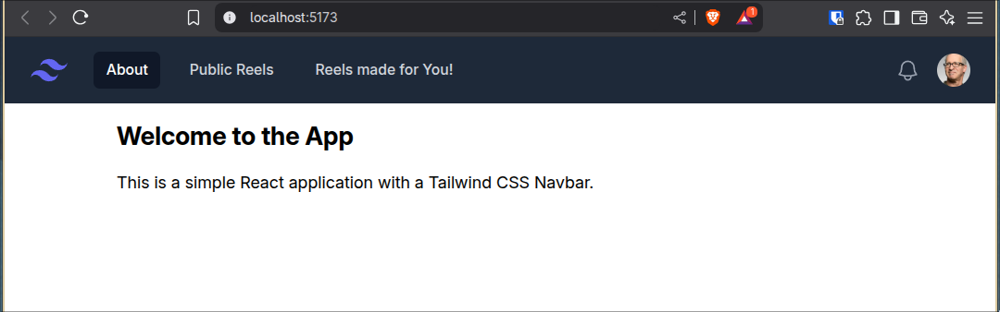
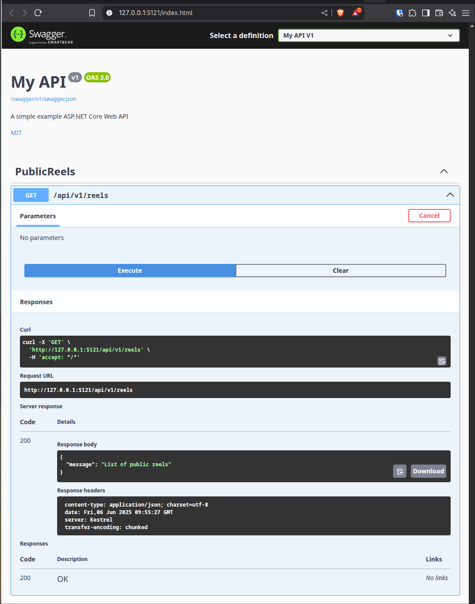

# Imobiliaria Highlight 

This is a demo project where,

> the **backend**, have a list of search task to perform
> while on it, it search through the real state supported website
> grab house and apartment information and check against AI if match the 
> search task criteria, then, store in the database those information.

> the **frontend**, on the other hand, present in form of reels all top matched
> search task submitted by users, and for one specific user who submit some search task
> it shows all matched results in form of reels made for him.

## Expected features

**Frontend**

- Reels results presentation
  - One for everyone
  - Another specifically for who submit search task
- Form to submit search tasks
- Page to check current search tasks status
  - Possible status
    - Not searched yet
    - Searching
    - No result matches

**Backend**

- Api for most relevant search tasks matches
- Api for matches of search tasks for specific users
- Api for submit search tasks and check its status

## Preview

**FrontEnd**

**Backend**

